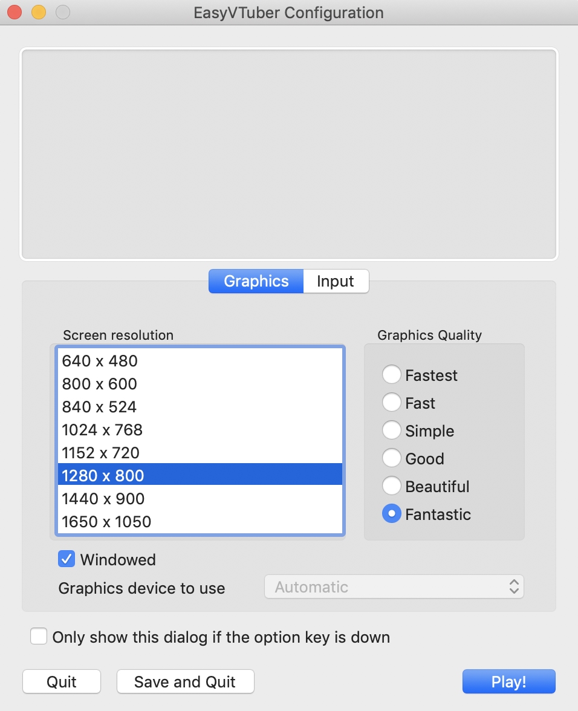
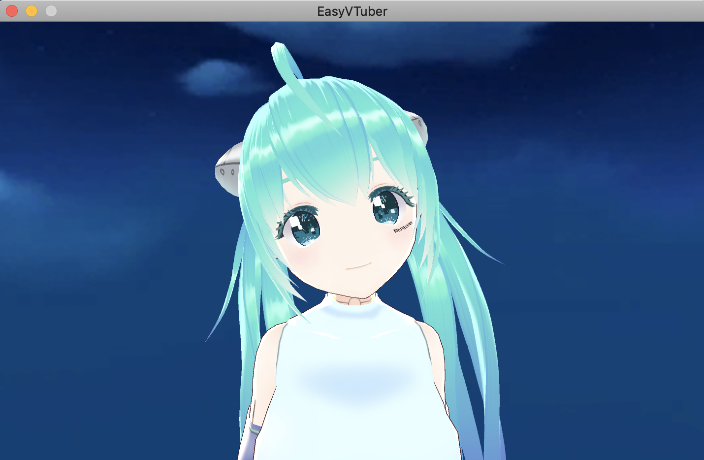
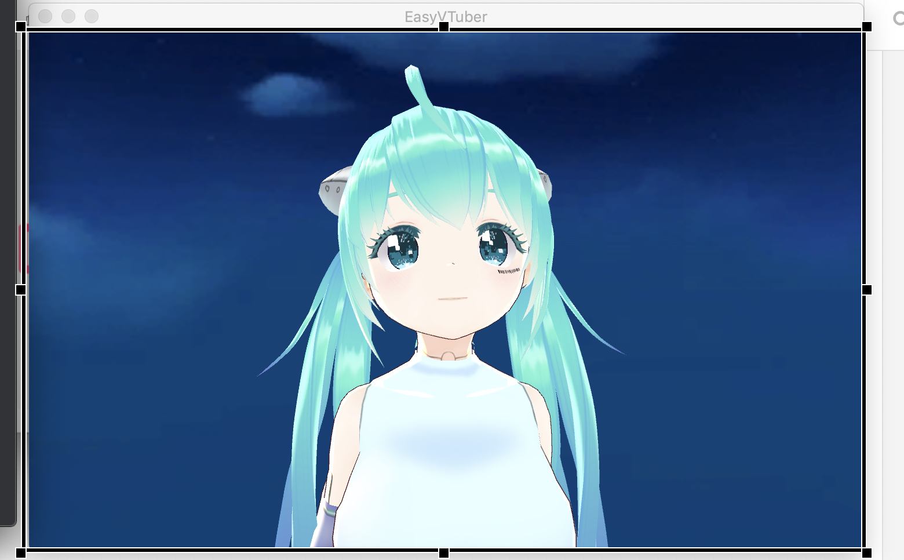
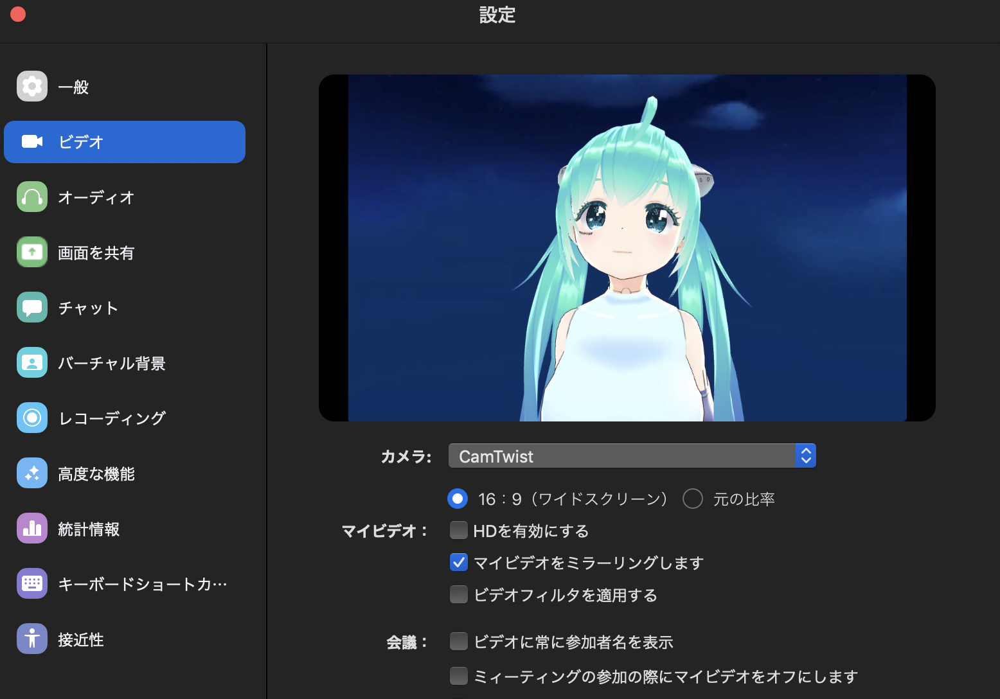
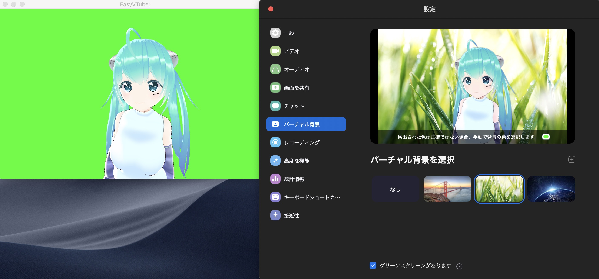
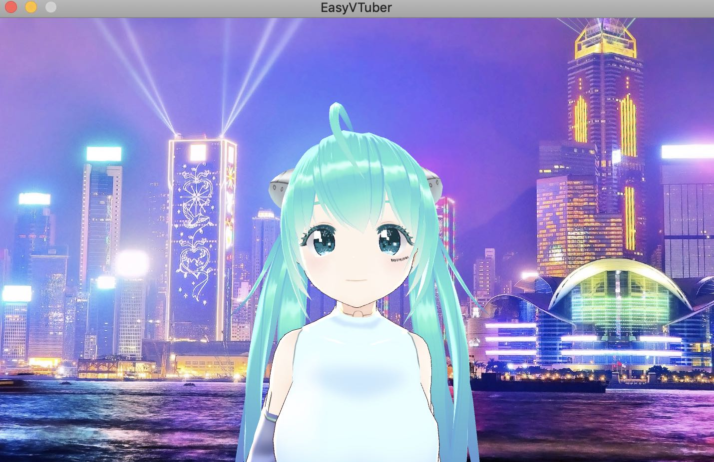

# EasyVTuber
* Macだけでバ美肉会議するための簡易ツールです。
* アバターはVRMのみ対応しています。 

# Requirement
以下の環境で動作確認済みです。
* Mac OS Mojave(10.14)
* Mac OS Catalina(10.15)

仮想カメラにCamTwistを利用するためダウンロードしてください。
* [CamTwist 3.4.3](http://camtwiststudio.com/download/)

# How to Use

## フェイストラッキングの開始
* [VRoid Hub](https://hub.vroid.com)などからVRMファイルをダウンロード。
* Macのローカルディスクのユーザのホームディレクトリにavatar.vrmという名前で配置  
  (例： OSユーザがyoshidanの場合、/Users/yoshidan/avatar.vrm)
* 下のリンクからアプリをダウンロードして起動。
https://drive.google.com/file/d/1Y9IkXH5VCh60tBIKv3LuVe7eS908pAL5/view  

optionキーを押しながら起動すると、画面サイズが聞かれるので任意のサイズを設定してPlayを押してください。  
Windowedを忘れると全画面になってしまうのでチェックをつけた方がよいです。  
そのままPlayすると設定が保存されるので次回以降はoptionキーを押しながら起動する必要はありません。  
初回optionキーを押さずに起動すると1280 * 800の解像度になります。

 

しばらくするとカメラのパーミッション許可が求められます。  
許可してしばらく待つとアプリにアバターが表示されます。

## CamTwistの設定
たぶん[このリンク](https://hori-ryota.com/blog/live-broadcasting-with-mac/)が分かりやすいですが、  
まとめると以下の手順を辿ればOKです。

1. Preferencesで解像度を変更
2. Step1でDesktop+を選択
3. SettingsのSelect from exsisting windowで「EasyVTuber」を選択
4. Select Capture areaボタンを押してウインドウのタイトル部が入らないようにエリアを設定

5. Done Selectionしてエリアを確定
6. Step3でSave Setupを実行

下図のような設定になっていればOKです。

* Cam Twistメイン画面

* Preferences

## 会議ツールでの使用（例:Zoom.us)
[Zoom.us](https://zoom.us/download)を起動してビデオ設定のカメラでCamTwistを選択してください。  
※ カメラにCamTwistが出ない場合は再起動してみてください。  

※ 2020/4/17 追記：どうやらZoomのversionを4.6.10以上にアップデートするとCam Twistを認識しないようです。  
　なので最新版のZoomでは動作しません。 [Zoom ダウングレード版はこちら](https://github.com/yoshidan/EasyVTuberRel/issues/3)
 
※ 2020/5/1 追記：Zoomがバーチャルカメラを認識しないのは、新しいZoomバージョンの署名により、署名のない3rdパーティーライブラリーの利用ができなくなったことを判明したため、逆にZoomの署名を消せばバーチャルカメラの利用が可能になります。具体的にはターミナルに入って、次のコマンドを打てばいいです： `$ codesign --remove-signature /Applications/zoom.us.app/` （Xcodeがインストール済みである必要があります；また権限周りのエラーが起きた場合、`sudo codesign` 等で対応可能なはずです。）

## Zoomでのバーチャル背景の使用
アプリをアクティブにしてキーボードで「g」を押すと背景がグリーンスクリーンになります。  
Zoomのバーチャル背景で「グリーンスクリーンがあります」にチェックをつけるとバーチャル背景が完全になります。

## 自前の背景の利用

バーチャル背景が使えないツール用です。  
アバターと同じディレクトリにbackground.jpgという名称で画像を保存  
(例： OSユーザがyoshidanの場合、/Users/yoshidan/background.jpg)

アプリ起動時に、背景を配置した画像に変更します。  
画像のアスペクト比を保ったまま横方向は全て表示します。  
画像のアスペクト比が画面のアスペクト比と合わない場合、縦方向は中央中心に切り取って表示します。  

# 機能
## キーボード
アプリをアクティブにした状態で以下のキーコードを認識します。

| キーコード | 機能 |
|----------|------|
| a | 表情をAngryにする |
| j | 表情をJoyにする |
| f | 表情をFunにする |
| s | 表情をsurprisedにする |
| e | 表情をExtraにする |
| g | 背景をグリーンスクリーンと切り替える |
| c | カメラの方を向かせる |

## カメラ操作
* 正ボタンをクリックしながらスクロールで縦横回転する
* 副ボタンをクリックしながらスクロールで上下移動する
* 2FingerでスクロールするとZoom in/outする

# その他 
* バ美声は対応していませんので、voidolとsoundflowerを使って仮想マイクを作るなどしてください。
