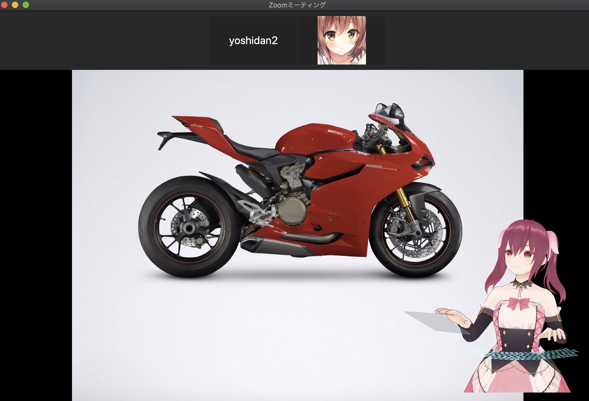
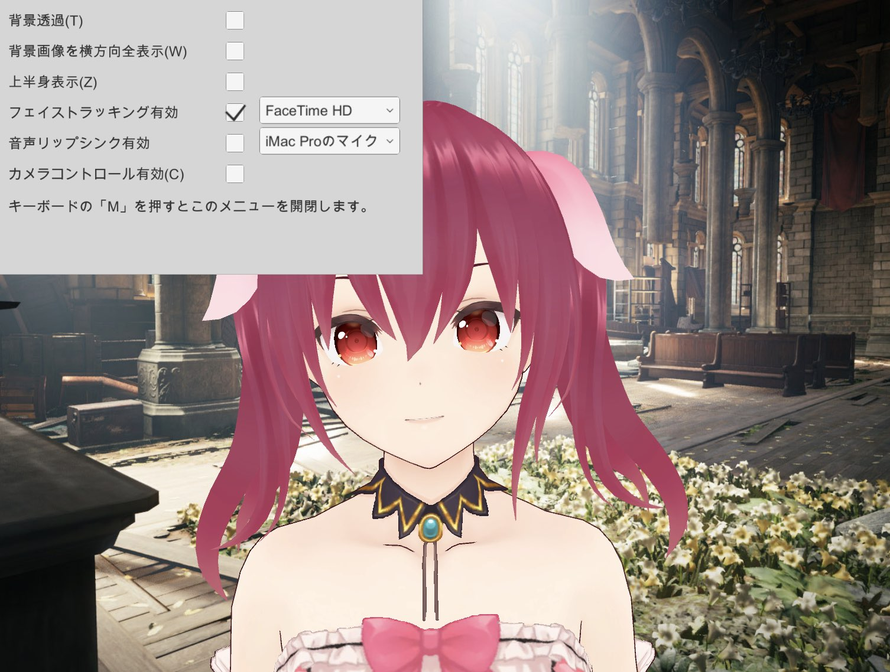

# EasyVTuber
* Macだけでバ美肉会議するための簡易ツールです。
* アバターはVRMのみ対応しています。 

ビデオチャット  

デスクトップ配信  

* 旧バージョンから大幅に動作が変わっています。旧バージョンは[こちら](OLD_VERSION.md)

# Requirement
以下の環境で動作確認済みです。
* Mac OS Mojave(10.14)
* Mac OS Catalina(10.15)

仮想カメラにCamTwistを利用するためダウンロードしてください。
* [CamTwist 3.4.3](http://camtwiststudio.com/download/)

# How to Use

## 起動
* [VRoid Hub](https://hub.vroid.com)などからVRMファイルをダウンロード。
* Macのローカルディスクのユーザのホームディレクトリにavatar.vrmという名前で配置  
  (例： OSユーザがyoshidanの場合、/Users/yoshidan/avatar.vrm)
* 下のリンクからアプリをダウンロードして起動。
https://github.com/yoshidan/EasyVTuberRel/releases 

* 初回実行時にアクセシビリティの実行権限が求められます。アクセシビリティに権限を与えて、再起動してください。  
  権限がない場合は、後述する上半身表示モードにおいて、アプリがアクティブになっていない時にキータイプ時の動きがなくなります）

  
  

* カメラのパーミッション許可が求められますので許可してください。 許可するとトラッキングが開始されます。  

注） アクセシビリティの権限付与は、アプリを再起動しないと反映されないので注意してください。

* アプリはデスクトップの最前面に常駐します。（Keynoteの全画面再生時よりも前面）

## CamTwistの設定
たぶん[このリンク](https://hori-ryota.com/blog/live-broadcasting-with-mac/)が分かりやすいですが、  
まとめると以下の手順を辿ればOKです。

1. Preferencesで解像度を変更
2. Step1でDesktop+を選択
3. SettingsのSelect from exsisting windowで「EasyVTuberNew」を選択

下図のような設定になっていればOKです。

* Cam Twistメイン画面

* Preferences

## 会議ツールでの使用（例:Zoom.us)
[Zoom.us](https://zoom.us/download)を起動してビデオ設定のカメラでCamTwistを選択してください。  
* カメラにCamTwistが出ない場合は再起動してみてください。  
* それでも認識しない場合は、Zoomのバージョンに問題があります。最新版にして、以下のコマンドを実行してみてください。
`$ codesign --remove-signature /Applications/zoom.us.app/` （Xcodeがインストール済みである必要があります；また権限周りのエラーが起きた場合、`sudo codesign` 等で対応可能なはずです。）

## リサイズ
* アプリのウインドウの端をドラッグしてリサイズして、zoomのビデオ幅に合わせることができます。また、デスクトップ共有時のマスコットの大きさの変更にも利用できます。

## Zoomでのバーチャル背景の使用
Zoomのバーチャル背景で「グリーンスクリーンがあります」にチェックをつけるとバーチャル背景が完全になります。

## 自前の背景の利用

バーチャル背景が使えないツール用です。  
アバターと同じディレクトリにbackground.jpgという名称で画像を保存  
(例： OSユーザがyoshidanの場合、/Users/yoshidan/background.jpg)

アプリ起動時に、背景を配置した画像に変更します。  
デフォルトでは、画像のアスペクト比を保ったまま横方向は全て表示します。画像のアスペクト比が画面のアスペクト比と合わない場合、縦方向は中央中心に切り取って表示します。
設定画面で 縦方向全表示との切り替えが可能です。   

## 画面共有による配信

* アプリの背景を透過にして、Zoomの画面共有でデスクトップを配信すると、アバターも一緒に配信できます。
* この時、カメラの方はoffにしておくことをおすすめします。（カメラの方でもアバターが見えると違和感ありますし、オフにした方が帯域に優しいですし。）
* アプリのウインドウをリサイズしてアバターのサイズを調整できます。

相手側からは以下のように見えています。  

# アプリ機能

## メニュー(ショートカットキー「m」)
アプリがアクティブになっている時にキーボードの「m」を押すと、以下のようにメニュー画面が開きます。  
※ アプリ自体はウインドウの最前面に常駐しますが、アクティブにするにはマウスでウインドウを選択する必要があります。

| 機能 | 説明 | ショートカットーキー | 
| ---- | ---- | ----------- | 
| 背景透過 | 背景を透明にします | t |
| 背景画像を横方向全表示 | 横長の画像用に横方向に画像を全部表示するようにします。縦長画像の場合はチェックを外してください。 | w |
| 上半身表示 | カメラを引き、キータイプとマウス操作をアバターに反映するようになります | z |
| フェイストラッキング開始 | カメラを切り替える場合に使用します |  |
| 音声リップシンク有効 | デフォルトではフェイストラッキングで口を動かしますが、オンにすると音声で動かすようになります |  |
| カメラコントロール有効 | デフォルトではWindowをドラッグするとアプリを移動しますが、オンにするとアプリ内でYaw方向のカメラ回転ができます。副ボタンを押しながらスクロールすると方向縦移動できます。カメラコントロール中はWindow移動ができないので、Windowを移動したい場合は、カメラコントロールのチェックを外してください。 | c |

## 表情ショートカット
アプリをアクティブにした状態で以下のキーコードを認識します。2回押すと表情を戻します。

| キーコード | 機能 |
|----------|------|
| a | 表情をAngryにする |
| j | 表情をJoyにする |
| f | 表情をFunにする |
| s | 表情をsurprisedにする |
| e | 表情をExtraにする |

# その他
* Windows専用ツール[VMagicMirror](https://booth.pm/ja/items/1272298)のv1.0.0版のソースを元に、[macOS用のPlugin](https://github.com/yoshidan/UnityNativeWindow)を組み合わせて作っています。
* 機能はかなり減らしていますので、Windowsをお使いの方は[VMagicMirror](https://booth.pm/ja/items/1272298)の利用を推奨します。

